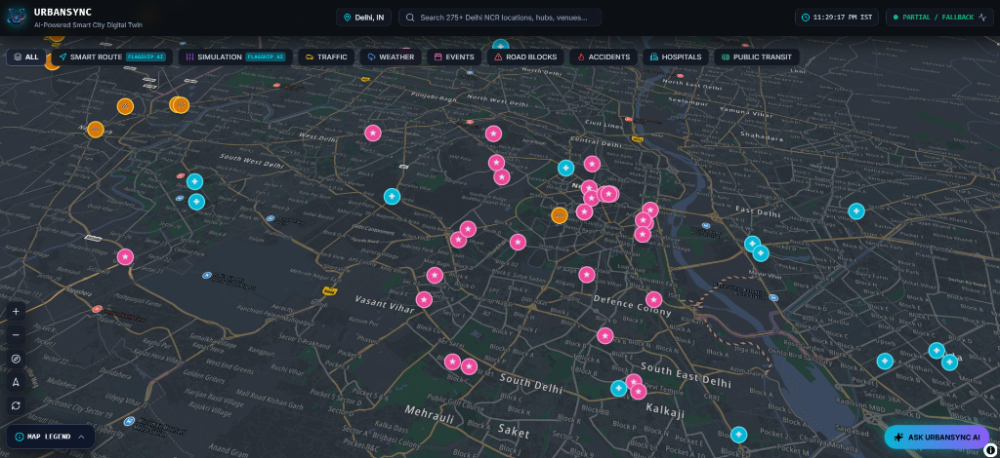
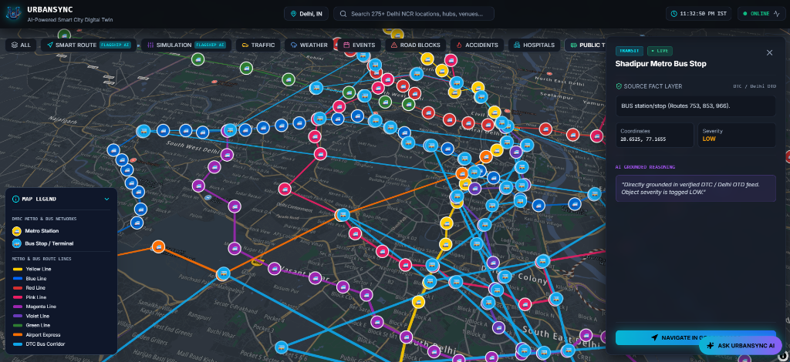
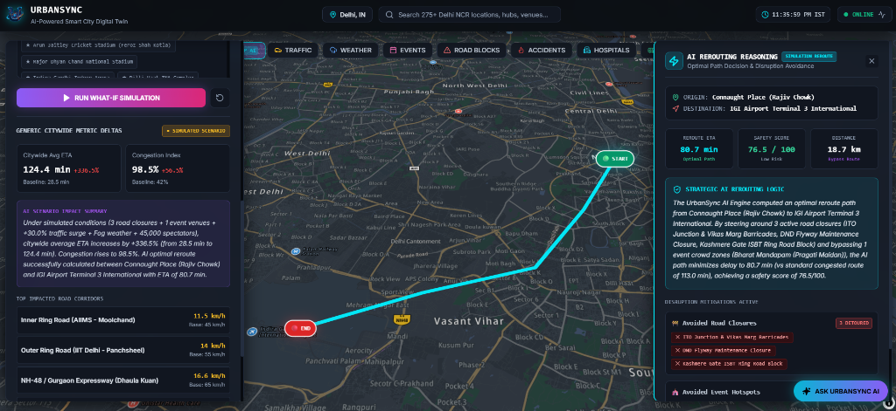

# 🏙️ UrbanSync — AI-Powered Smart City Digital Twin

> **City Focus**: Delhi, India 🇮🇳  
> **Core Philosophy**: `OBSERVE` 👁️ ➔ `UNDERSTAND` 🧠 ➔ `PREDICT` 🔮 ➔ `SIMULATE` 🧪 ➔ `OPTIMIZE` ⚡ ➔ `EXPLAIN` 🗣️

---

## 🌟 Project Overview

**UrbanSync** is a cutting-edge **AI-Powered Smart City Digital Twin** for Delhi, India. It aggregates multi-source urban data streams—including real-time traffic incidents, extreme weather cells, spectator events, open transit networks, and emergency hospital facilities—into a dynamic 2.5D interactive dark map interface.

Powered by **MapLibre GL JS**, **TomTom APIs**, **Open-Meteo**, **OpenStreetMap Overpass**, and **Groq LLMs**, UrbanSync delivers real-time decision-support, predictive routing, and scenario simulation tools:
- 🤖 **UrbanSync AI Assistant**: Grounded conversational assistant with tool calling and rich custom Markdown rendering.
- 🎯 **AI Smart Route Engine**: Multi-criteria routing across 275+ Delhi NCR locations, evaluating traffic delays, weather risks, road barricades, and crowd radii.
- 🧪 **What-If City Simulation Engine**: Multi-variable scenario testing (16+ road closures, 16+ event hotspots, weather/demand sliders) rendering single optimal reroutes and strategic AI reasoning.
- 📍 **Global TopBar Search**: Search 275+ Delhi NCR locations with Google Maps style Red Drop Pin Needles, smooth camera `flyTo`, and direct Google Maps navigation links.
- 🚅 **DMRC Metro & Bus Transit Network**: 350+ stations & DTC bus stops with official color-coded Metro line route geometries highlighted on the map canvas.
- 🌤️ **5-Level Weather Spatial Grid**: Risk polygon overlays categorizing rain, fog, and waterlogging hazards across 6 spatial zones.
- 🩺 **System Health Telemetry**: Real-time status modal tracking data ingestion states (`LIVE`, `STATIC / GTFS`, `FALLBACK`, `DEGRADED`) with relative timestamps.

---

## ✨ Feature Deep-Dives

### 🤖 1. UrbanSync AI Assistant
- **Engine**: Powered by Groq LLM (`openai/gpt-oss-20b` or rule-based fallback).
- **Grounded Tool Calling**: Executes actual backend data lookups to answer complex urban queries:
  - `get_current_weather`: Queries active weather cells across Delhi sub-regions.
  - `get_active_incidents`: Retrieves TomTom traffic bottlenecks, queue delays, and crashes.
  - `get_major_events`: Fetches ongoing public events and crowd venue attendances.
  - `find_best_hospital`: Ranks regional hospitals by trauma capabilities and beds.
  - `run_simulation_summary`: Calculates hypothetical scenario impacts.
- **Custom Markdown Formatting Parser**: Uses an inline parser converting bold tags (`**text**`), bullet points (`•` / `-`), code blocks (```code```), and line breaks into clean, formatted typography without displaying raw Markdown symbols.

### 🎯 2. AI Smart Routing & 275+ Location Index
- **275+ Delhi NCR Locations**: Autocomplete search covering all major and medium value locations in Delhi, Gurgaon, Noida, Ghaziabad, and Faridabad + "📍 Live Location" GPS geolocation support.
- **4 Optimization Categories**:
  1. ⚡ **Fastest Time**: Minimizes queue delays and congestion bottlenecks.
  2. 🛡️ **Safest Corridor**: Avoids crash zones, waterlogging, and road repairs.
  3. 🟢 **Lowest Congestion**: Detours around heavy traffic corridors.
  4. 🚑 **Emergency Transit**: Prioritizes hospital access corridors.
- **Decision Engine**: Combines NetworkX graph math with multi-source telemetry scoring (TomTom delay seconds + weather risk penalty + crowd radius buffer + barricade penalty).
- **Map Visualizations**:
  - Highlights selected recommended route in custom **`#00F0FF` Cyan (7px width)** and alternatives in dashed lines.
  - Places distinct **`🟢 START`** origin and **`🔴 END`** destination HTML map markers.
  - **Auto-Cleanup**: Closing the routing panel immediately removes route lines and markers from the map canvas.

### 🧪 3. What-If AI Simulation Engine
- **Scenario Builder**:
  - Origin & Destination selection from 275+ Delhi locations or live GPS.
  - Multi-select toggles for **16+ Road Closure corridors** (Ring Road, NH-48, ITO, Barapullah, etc.).
  - Traffic Demand Surge slider (0% to +100%) and Weather Severity slider (Clear to Heavy Smog/Rain).
  - Multi-select toggles for **16+ Major Event Hotspot Venues** (Bharat Mandapam, JLN Stadium, Connaught Place, etc.).
- **Map & Panel Rendering**:
  - Single returned optimal AI reroute path rendered cleanly on the map canvas with **`🟢 START`** and **`🔴 END`** markers.
  - **Left-Panel City Impact**: Displays citywide ETA shift (+%), emissions delta, and average network speed.
  - **Right-Side Strategic Reasoning Panel**: Presents AI decision rationale, bypassed barricades, avoided crowd zones, and safety score.
  - **Auto-Cleanup**: Closing the simulation drawer destroys all reroute lines and markers immediately.

### 📍 4. Global TopBar Search & Red Drop Pin Needle
- **Search Bar**: Autocomplete search over 275+ Delhi NCR locations in the top navigation header.
- **Red Pin Needle**: Selecting a location places a classic **Google Maps-style Red Drop Pin Needle (`📍`)** at the exact GPS coordinates.
- **Camera Animation**: Smoothly flies the map camera (`map.flyTo`) to the target location.
- **Right Detail Panel**: Displays venue details, coordinates, district information, and a **`NAVIGATE IN GOOGLE MAPS ↗`** button opening `https://www.google.com/maps/search/?api=1&query=lat,lng`.
- **Auto-Cleanup**: Closing the detail panel or switching category tabs automatically removes the red pin needle.

### 🚅 5. DMRC Metro & DTC Bus Public Transit Network
- **Highlighted Route Corridors**: Renders official color-coded LineString geometries across the Delhi NCR map canvas:
  - 🟡 **Yellow Line** (`#FFCC00`): Samaypur Badli ➔ Millennium City Centre Gurgaon
  - 🔵 **Blue Line** (`#0066FF`): Dwarka Sector 21 ➔ Noida City Centre / Vaishali
  - 🔴 **Red Line** (`#D32F2F`): Rithala ➔ Shaheed Sthal Ghaziabad
  - 🩷 **Pink Line** (`#E91E63`): Majlis Park ➔ Shiv Vihar Ring Corridor
  - 🟣 **Magenta Line** (`#9C27B0`): Janakpuri West ➔ Botanical Garden
  - 🟣 **Violet Line** (`#673AB7`): Kashmere Gate ➔ Raja Nahar Singh Ballabhgarh
  - 🟢 **Green Line** (`#2E7D32`): Inderlok / Kirti Nagar ➔ Brig. Hoshiar Singh
  - 🟠 **Airport Express** (`#FF6F00`): New Delhi Railway Station ➔ Yashobhoomi Dwarka Sector 25
  - 🩵 **DTC Bus Corridor** (`#0EA5E9`): Major DTC Bus Trunk Arterials
- **350+ Transit Nodes**: Renders custom Metro station (`🚅`) and DTC Bus stop (`🚌`) markers.

### 🌤️ 6. 5-Level Weather Spatial Grid
- Categorizes localized meteorological telemetry into 5 color-coded spatial polygon grid overlays across 6 Delhi NCR sub-regions:
  1. 🩵 **Cyan (`#00F0FF`, 32% opacity)**: Normal / Clear Grid Perimeter
  2. 🟦 **Blue (`#3B82F6`)**: Light Rain / Low Hazard Drizzle
  3. 🟧 **Amber (`#F59E0B`)**: Moderate Precipitation & Wind
  4. 🟥 **Red (`#EF4444`)**: Heavy Rain & Waterlogging Risk Zone
  5. 🟪 **Purple (`#A855F7`)**: Dense Smog & Visibility Hazard (<500m)

### 🩺 7. System Health Status & Transparent Branding
- **System Health Modal**: Zero-polling background overhead; reads recorded ingestion adapter states on page load.
- **Categorized Status Badges**:
  - 🟢 **`LIVE` / `ONLINE`** (Green): External live API call succeeded (TomTom, Open-Meteo, Eventbrite, OSM Overpass, Groq LLM).
  - 🩵 **`STATIC / GTFS`** (Cyan): Official static GTFS metro/bus schedule database active.
  - 🟧 **`FALLBACK`** (Amber): Verified seed dataset active due to API key omission or timeout.
  - 🔴 **`DEGRADED`** (Red): Feature count is 0.
- **Dynamic Relative Timestamps**: Calculates exact elapsed time passed since fetch (`"Just now"`, `"2 mins ago"`, `"15 mins ago"`).
- **Brand Logo & Favicon**: Custom futuristic Delhi 'U' logo (`public/logo.png`, `public/favicon.png`) processed with background thresholding for transparent RGBA rendering with a cyan aura drop-shadow in the TopBar.
---

## 📸 Application Screenshots & Interface Glimpses

### Figure 1: UrbanSync Digital Twin Overview & Real-Time Telemetry Map

* **Figure 1 Description**: The central 2.5D dark-theme MapLibre GL JS engine rendering multi-source Delhi NCR telemetry layers—including active traffic slowdowns, barricaded construction zones, public events, emergency hospitals, and 5-level weather risk spatial grids. Features top navigation command header, instant 275+ location search bar, live system health status, tab category pills, collapsible map legend, and floating UrbanSync AI assistant trigger.

---

### Figure 2: DMRC Metro & DTC Bus Public Transit Network & Dynamic Map Legend

* **Figure 2 Description**: Highlights Delhi NCR's multi-modal public transit network across 350+ Metro stations and DTC Bus terminals. Color-coded route LineStrings display official DMRC Metro line corridors (Yellow, Blue, Red, Pink, Magenta, Violet, Green, Airport Express) and DTC Bus Corridors. The dynamic tab-scoped map legend categorizes route line colors, while the right-side grounded detail panel displays station route numbers, exact GPS coordinates, severity level, and one-click Google Maps navigation (`NAVIGATE IN GOOGLE MAPS ↗`).

---

### Figure 3: What-If AI Simulation Engine & Strategic Rerouting Reasoning Panel

* **Figure 3 Description**: Real-time What-If scenario simulation between Connaught Place (Rajiv Chowk) and IGI Airport Terminal 3 International under complex multi-disruption conditions (3 road closures + 1 spectator event + 30.0% traffic surge + fog weather). Displays the AI optimal reroute path highlighted in cyan (`#00F0FF`) with distinct `🟢 START` origin and `🔴 END` destination HTML map markers. The left drawer displays generic citywide metric deltas (+336.5% ETA surge, 98.5% congestion index, top impacted road corridors), while the right-side AI Rerouting Reasoning drawer presents strategic decision rationale, bypassed barricades, avoided event crowds, and safety scores.

---

## 🛠️ Tech Stack

### 🎨 Frontend
- **Framework**: Next.js 14 (App Router, React 18)
- **Language**: TypeScript
- **Styling**: Tailwind CSS, PostCSS
- **Mapping Engine**: MapLibre GL JS (`^4.1.0`)
- **Icons**: Lucide React

### ⚙️ Backend
- **Framework**: Python 3.11+, FastAPI, Uvicorn
- **Async Networking**: Aiohttp, Asyncio
- **Data Science & Graph Math**: NetworkX, Pandas, NumPy
- **Spatial ORM**: PostgreSQL, PostGIS, SQLAlchemy (Async), GeoAlchemy2
- **LLM Engine**: Groq API using **`openai/gpt-oss-20b`**

---

## 🌐 External APIs & Data Sources

| API / Service | Description | Integration Use Case |
| :--- | :--- | :--- |
| **TomTom Traffic API** | Live Traffic Incidents & Bounding Box Details | Real-time traffic delays, accidents, and queue lengths in Delhi NCR |
| **OpenStreetMap / Overpass API** | Open Spatial Queries (`overpass-api.de`) | Live retrieval of verified hospital locations, addresses, and emergency facilities |
| **Eventbrite Public Feed** | Live Regional Event Ingestion | Spectator gathering venues, current-hour filtering (`startDate <= now <= endDate`), and attendance bounds |
| **Open-Meteo API** | Multi-Grid Weather Telemetry | Localized precipitation, humidity, smog, and 5-level spatial risk overlays |
| **Delhi Open Transit Data** | GTFS Delhi Metro & Bus Feed | 350+ Metro stations & DTC bus stops with official color-coded line corridors |
| **Groq LLM API** | Fast LLM Inference API | Grounded conversational AI assistant responses and scenario reasoning |

---

## 📁 Project Structure

```text
urbansync/
├── backend/
│   ├── app/
│   │   ├── ai/                     # AI Assistant grounded chat integration (Groq LLM)
│   │   ├── api/
│   │   │   └── routes/             # FastAPI REST endpoints & WebSockets
│   │   ├── database/               # Seed data stores & PostgreSQL connection
│   │   ├── models/                 # Pydantic & SQLAlchemy schemas
│   │   └── services/
│   │       ├── hospital/           # Emergency hospital ranking engine
│   │       ├── ingestion/          # Data adapters (TomTom, OSM, Eventbrite, Weather)
│   │       ├── routing/            # Smart Route scoring & NetworkX graph engine
│   │       └── simulation/         # What-If city scenario simulator
│   ├── run_tests.py                # Backend automated verification suite
│   ├── requirements.txt            # Python dependencies
│   └── main.py                     # Entry point for FastAPI application
├── frontend/
│   ├── public/                     # Public assets (logo.png, favicon.png)
│   ├── src/
│   │   ├── app/                    # Next.js 14 App Router (page.tsx, layout.tsx)
│   │   ├── components/
│   │   │   ├── assistant/          # Floating AI Assistant widget
│   │   │   ├── hospitals/          # Emergency Hospital ranker drawer
│   │   │   ├── map/                # MapLibre GL JS CityMap & Legend
│   │   │   ├── navigation/         # Command header TopBar & CategoryBar
│   │   │   ├── panels/             # Feature DetailPanel
│   │   │   ├── routing/            # AI Smart Route drawer
│   │   │   └── simulation/         # What-If City Simulation drawers
│   │   ├── services/               # Axios API client & WebSocket connector
│   │   └── types/                  # TypeScript interface definitions
│   ├── package.json
│   ├── tailwind.config.js
│   └── .env.local                  # Next.js client environment keys
└── README.md
```

---

## ⚡ How to Run (Setup Instructions)

### 1. Prerequisites
- **Node.js**: `v18.0.0` or higher
- **Python**: `v3.11` or higher

---

### 2. Environment Configuration
Create `.env` in the root folder:
```env
TOMTOM_API_KEY=YOUR_TOMTOM_API_KEY_HERE
WEATHERAPI_KEY=YOUR_WEATHERAPI_KEY_HERE
OPEN_METEO_ENABLED=true
OVERPASS_API_URL=https://overpass-api.de/api/interpreter
GROQ_API_KEY=YOUR_GROQ_API_KEY_HERE
GROQ_MODEL=openai/gpt-oss-20b
```

Create `frontend/.env.local`:
```env
NEXT_PUBLIC_TOMTOM_API_KEY=YOUR_TOMTOM_API_KEY_HERE
NEXT_PUBLIC_API_URL=http://localhost:8000
NEXT_PUBLIC_WS_URL=ws://localhost:8000/ws
```

---

### 3. Backend Setup
```powershell
cd backend
python -m venv venv
venv\Scripts\activate      # On Windows
pip install -r requirements.txt
python run_tests.py
python app/main.py
```

---

### 4. Frontend Setup
```powershell
cd frontend
npm install
npm run dev
```
> Frontend application will be running at `http://localhost:3000`.

---

## 👨‍💻 Authors & Maintainers

<table align="center">
  <tr>
    <td align="center" width="50%">
      <a href="https://github.com/RahulBansal-24">
        <br />
        <sub><b>👨‍💻 Rahul Bansal</b></sub>
      </a><br />
      <p>🚀 Full-Stack Developer | 🤖 AI Developer</p>
      <a href="mailto:itzrahulbansal24@gmail.com">📧 Email</a> • 
      <a href="https://github.com/RahulBansal-24">🔗 GitHub</a> • 
      <a href="https://www.linkedin.com/in/itsrahulbansal24">💼 LinkedIn</a>
    </td>
    <td align="center" width="50%">
      <a href="https://github.com/mahi040-pixel">
        <br />
        <sub><b>👩‍💻 Mahi Varshney</b></sub>
      </a><br />
      <p>🌐 Web Developer | 🧠 AI Engineer</p>
      <a href="mailto:mahivarshney08@gmail.com">📧 Email</a> • 
      <a href="https://github.com/mahi040-pixel">🔗 GitHub</a> • 
      <a href="https://www.linkedin.com/in/mahi-varshney-ba76ab378/">💼 LinkedIn</a>
    </td>
  </tr>
</table>

---
<p align="center">Made with ❤️ for Smart Cities & Urban Innovation</p>
