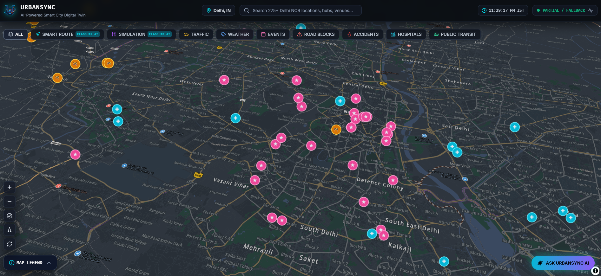
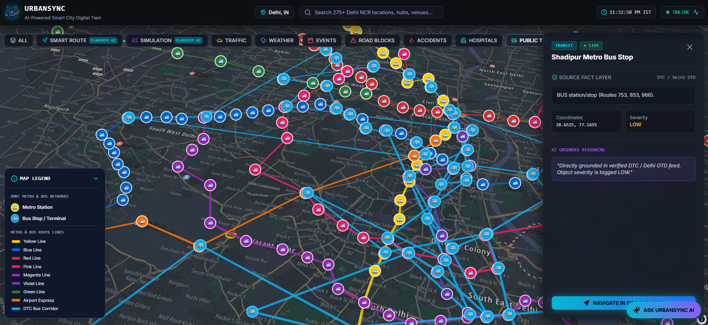
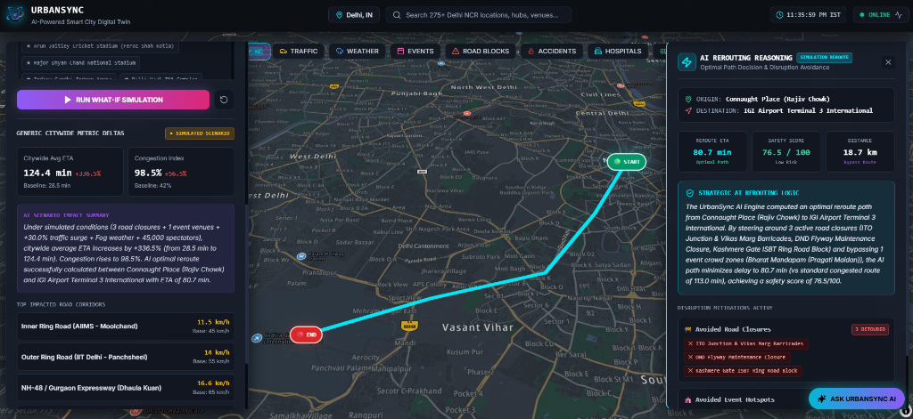

# 🏙️ UrbanSync — AI-Powered Smart City Digital Twin

<div align="center">
  
  
  
  
  
  
  
  
</div>

---

> **City Focus**: Delhi, India  
> **Core Philosophy**: `OBSERVE` 👁️ ➔ `UNDERSTAND` 🧠 ➔ `PREDICT` 🔮 ➔ `SIMULATE` 🧪 ➔ `OPTIMIZE` ⚡ ➔ `EXPLAIN` 🗣️

---

## 🌟 Project Overview

**UrbanSync** is a cutting-edge **AI-Powered Smart City Digital Twin** designed specifically for Delhi, India. It aggregates multi-source urban spatial data streams—including real-time traffic incidents, extreme weather cells, spectator events, open transit networks, and emergency hospital facilities—into a dynamic 2.5D interactive dark map command center interface.

Powered by **MapLibre GL JS**, **TomTom APIs**, **Open-Meteo**, **OpenStreetMap Overpass**, **Delhi Open Transit Data (DMRC/DTC GTFS)**, and **Groq LLMs**, UrbanSync delivers real-time decision-support, multi-criteria predictive routing, and scenario simulation tools for urban mobility managers, emergency responders, and city residents.

---

## 🚀 Key Features

- 🤖 **UrbanSync AI Assistant**: Grounded conversational assistant with tool calling and rich custom Markdown rendering.
- 🎯 **AI Smart Route Engine**: Multi-criteria routing across 275+ Delhi NCR locations, evaluating traffic delays, weather risks, road barricades, and crowd radii.
- 🧪 **What-If City Simulation Engine**: Multi-variable scenario testing (16+ road closures, 16+ event hotspots, weather/demand sliders) rendering single optimal reroutes and strategic AI reasoning.
- 📍 **Global TopBar Search**: Search 275+ Delhi NCR locations with Google Maps style Red Drop Pin Needles, smooth camera `flyTo`, and direct Google Maps navigation links.
- 🚅 **DMRC Metro & Bus Transit Network**: 350+ stations & DTC bus stops with official color-coded Metro line route geometries highlighted on the map canvas.
- 🌤️ **5-Level Weather Spatial Grid**: Risk polygon overlays categorizing rain, fog, and waterlogging hazards across 6 spatial zones.
- 🩺 **System Health Telemetry**: Real-time status modal tracking data ingestion states (`LIVE`, `STATIC / GTFS`, `FALLBACK`, `DEGRADED`) with relative timestamps.

---

## 🤖 UrbanSync AI Assistant

### 🎯 Purpose
Serves as an intelligent conversational co-pilot for urban planners, fleet operators, and citizens, turning complex geospatial telemetry into actionable natural language insights.

### 🧠 Key Functionality
- Grounded conversational assistant executing real backend tool calls against live city ingestion engines.
- Answers complex multi-domain queries regarding live weather hazards, traffic bottlenecks, active spectator events, trauma hospital availability, and scenario simulation summaries.
- Renders formatted responses inline with custom typographic parsing.

### 🛠️ Grounded Tool Calling Capabilities
| Tool Signature | Executed Action & Output Data Source |
| :--- | :--- |
| `get_current_weather()` | Queries active weather risk cells across 6 Delhi sub-regions |
| `get_active_incidents()` | Retrieves TomTom traffic bottlenecks, queue delays, and crashes |
| `get_major_events()` | Fetches ongoing public spectator events and venue attendance bounds |
| `find_best_hospital()` | Ranks regional hospitals by distance, traffic ETA, and trauma capability |
| `run_simulation_summary()` | Calculates hypothetical scenario impact metrics deltas |

### 🔬 Implementation Highlights
- **LLM Engine**: Powered by Groq LLM API utilizing `openai/gpt-oss-20b` with automated fallback to rule-based heuristic responses if API key is unconfigured.
- **Custom Markdown Formatting Parser**: Converts raw Markdown syntax (bold tags `**text**`, bullet points `•` / `-`, code blocks ` ```code``` `, line breaks) into clean typography without displaying raw formatting symbols in chat bubbles.

---

## 🎯 AI Smart Routing Engine & 275+ Location Index

### 🎯 Purpose
Navigates complex urban environments by balancing speed, safety, weather risk, and emergency access rather than relying solely on distance.

### 🧠 Key Functionality
- **275+ Delhi NCR Locations Index**: Comprehensive location database covering major and medium-value hubs across Delhi, Gurgaon, Noida, Ghaziabad, and Faridabad + "📍 Live Location" GPS geolocation support.
- **4 Multi-Criteria Optimization Profiles**:
  1. ⚡ **Fastest Time**: Minimizes queue delays and congestion bottlenecks using TomTom delay telemetry.
  2. 🛡️ **Safest Corridor**: Detours around crash zones, active waterlogging, and road repairs.
  3. 🟢 **Lowest Congestion**: Avoids heavily congested trunk corridors.
  4. 🚑 **Emergency Transit**: Prioritizes hospital access corridors and emergency vehicle access points.

### 🔬 Implementation Highlights
- **Graph & Scoring Engine**: Uses NetworkX graph pathfinding combined with multi-source telemetry scoring:
  $$\text{Corridor Cost} = \text{FreeFlow Time} + \text{TomTom Delay} + \text{Weather Risk Penalty} + \text{Crowd Radius Buffer} + \text{Barricade Penalty}$$
- **Map Visualizations**:
  - Highlights selected primary route in custom **`#00F0FF` Cyan (7px width)** and alternative routes in dashed styling.
  - Places distinct **`🟢 START`** origin and **`🔴 END`** destination HTML map markers.
  - **Auto-Cleanup**: Closing the routing panel immediately removes route lines and map markers from the canvas.

---

## 🧪 What-If AI City Simulation Engine

### 🎯 Purpose
Provides a predictive sandbox for traffic authorities and city administrators to simulate hypothetical urban grid disruptions before making physical traffic diversions or road closure decisions.

### 🧠 Key Functionality
- **Multi-Variable Scenario Builder**:
  - Origin & Destination selection from 275+ Delhi locations or live GPS coordinates.
  - Multi-select toggles for **16+ Road Closure corridors** (Ring Road, NH-48, ITO Junction, Barapullah Flyover, etc.).
  - Traffic Demand Surge slider (0% to +100%) and Weather Severity slider (Clear to Heavy Smog/Rain).
  - Multi-select toggles for **16+ Major Event Hotspot Venues** (Bharat Mandapam, JLN Stadium, Connaught Place, etc.).

### 🔬 Implementation Highlights
- **Dual Drawer Interface**:
  - **Left-Panel City Impact Metrics**: Displays citywide ETA shift (+%), network congestion index, emissions delta, and top impacted road corridors.
  - **Right-Side Strategic AI Reasoning Panel**: Presents granular decision rationale, bypassed barricades, avoided crowd zones, and corridor safety scores.
- **Single Reroute Rendering**: Renders a single, optimal AI reroute path highlighted in cyan (`#00F0FF`) with `🟢 START` and `🔴 END` markers.
- **Auto-Cleanup**: Closing the simulation drawer instantly destroys all reroute lines and markers.

---

## 📍 Global TopBar Search & Location Needle

### 🎯 Purpose
Delivers quick spatial lookup and single-click camera navigation across 275+ Delhi NCR locations directly from the header navigation bar.

### 🧠 Key Functionality
- **Autocomplete Search Bar**: Search across 275+ Delhi NCR venues, landmarks, metro stations, and districts in the top navigation header.
- **Red Drop Pin Needle (`📍`)**: Selecting a search item places a classic Google Maps-style Red Drop Pin Needle at exact spatial coordinates.
- **Camera Animation**: Smoothly animates the map camera (`map.flyTo`) to zoom and focus on the target destination.

### 🔬 Implementation Highlights
- **Right Detail Panel**: Displays venue details, exact coordinates, district category, and a **`NAVIGATE IN GOOGLE MAPS ↗`** button opening `https://www.google.com/maps/search/?api=1&query=lat,lng`.
- **Auto-Cleanup**: Closing the detail panel or switching map category tabs automatically removes the red pin needle.

---

## 🚅 DMRC Metro & DTC Bus Public Transit Network

### 🎯 Purpose
Visualizes Delhi's multi-modal public transportation network to promote green transit alternatives and analyze transit corridor health.

### 🧠 Key Functionality
- **Highlighted Route Corridors**: Renders official color-coded LineString geometries across the Delhi NCR map canvas:
  - 🟡 **Yellow Line** (`#FFCC00`): Samaypur Badli ➔ Millennium City Centre Gurgaon
  - 🔵 **Blue Line** (`#0066FF`): Dwarka Sector 21 ➔ Noida City Centre / Vaishali
  - 🔴 **Red Line** (`#D32F2F`): Rithala ➔ Shaheed Sthal Ghaziabad
  - 🩷 **Pink Line** (`#E91E63`): Majlis Park ➔ Shiv Vihar Ring Corridor
  - 🟣 **Magenta Line** (`#9C27B0`): Janakpuri West ➔ Botanical Garden
  - 🟣 **Violet Line** (`#673AB7`): Kashmere Gate ➔ Raja Nahar Singh Ballabhgarh
  - 🟢 **Green Line** (`#2E7D32`): Inderlok / Kirti Nagar ➔ Brig. Hoshiar Singh
  - 🟠 **Airport Express** (`#FF6F00`): New Delhi Railway Station ➔ Yashobhoomi Dwarka Sector 25
  - 🩵 **DTC Bus Corridor** (`#0EA5E9`): Major DTC Bus Trunk Arterials
- **350+ Transit Nodes**: Displays custom Metro station (`🚅`) and DTC Bus stop (`🚌`) markers with grounded metadata panels.

---

## 🌤️ 5-Level Weather Spatial Grid & Risk Advisories

### 🎯 Purpose
Monitors localized micro-climate severe weather conditions and calculates real-time transportation hazard advisories across Delhi's administrative sub-regions.

### 🧠 Key Functionality
Categorizes localized meteorological telemetry into 5 color-coded spatial polygon grid overlays across 6 Delhi NCR sub-regions:
1. 🩵 **Cyan (`#00F0FF`, 32% opacity)**: Normal / Clear Grid Perimeter (Low Risk)
2. 🟦 **Blue (`#3B82F6`)**: Light Rain / Low Hazard Drizzle
3. 🟧 **Amber (`#F59E0B`)**: Moderate Precipitation & Wind Gusts
4. 🟥 **Red (`#EF4444`)**: Heavy Rain & Critical Waterlogging Risk Zone
5. 🟪 **Purple (`#A855F7`)**: Dense Smog & Low Visibility Hazard (<500m)

### 🔬 Advisory Calculation Matrix
Dynamic advisory engine evaluates precipitation, visibility, wind speed, and thermal stress to issue specific warnings (e.g., recommending two-wheeler or low-clearance vehicle restrictions during waterlogging).

---

## 🩺 System Health Telemetry & Transparent Status

### 🎯 Purpose
Provides complete operational transparency by broadcasting the exact state of external API ingestion feeds and background data adapters.

### 🧠 Key Functionality
- **System Health Modal**: Zero-polling background overhead; reads recorded ingestion adapter states on page load.
- **Categorized Status Badges**:
  - 🟢 **`LIVE` / `ONLINE`** (Green): External live API call succeeded (TomTom, Open-Meteo, Eventbrite, OSM Overpass, Groq LLM).
  - 🩵 **`STATIC / GTFS`** (Cyan): Official static GTFS metro/bus schedule database active.
  - 🟧 **`FALLBACK`** (Amber): Verified seed dataset active due to API key omission or timeout.
  - 🔴 **`DEGRADED`** (Red): Feature count is 0.
- **Dynamic Relative Timestamps**: Calculates exact elapsed time since last sync (`"Just now"`, `"1 min ago"`, `"15 mins ago"`).
- **Brand Transparency**: Custom futuristic Delhi 'U' logo (`public/logo.png`, `public/favicon.png`) with cyan drop-shadow rendering in the TopBar.

---

## 📸 Application Screenshots & Interface Glimpses

### Figure 1: UrbanSync Digital Twin Overview & Real-Time Telemetry Map

* **Figure 1 Description**: The central 2.5D dark-theme MapLibre GL JS engine rendering multi-source Delhi NCR telemetry layers—including active traffic slowdowns, barricaded construction zones, public events, emergency hospitals, and 5-level weather risk spatial grids. Features top navigation command header, instant 275+ location search bar, live system health status, tab category pills, collapsible map legend, and floating UrbanSync AI assistant trigger.

---

### Figure 2: DMRC Metro & DTC Bus Public Transit Network & Dynamic Map Legend

* **Figure 2 Description**: Highlights Delhi NCR's multi-modal public transit network across 350+ Metro stations and DTC Bus terminals. Color-coded route LineStrings display official DMRC Metro line corridors (Yellow, Blue, Red, Pink, Magenta, Violet, Green, Airport Express) and DTC Bus Corridors. The dynamic tab-scoped map legend categorizes route line colors, while the right-side grounded detail panel displays station route numbers, exact GPS coordinates, severity level, and one-click Google Maps navigation (`NAVIGATE IN GOOGLE MAPS ↗`).

---

### Figure 3: What-If AI Simulation Engine & Strategic Rerouting Reasoning Panel

* **Figure 3 Description**: Real-time What-If scenario simulation between Connaught Place (Rajiv Chowk) and IGI Airport Terminal 3 International under complex multi-disruption conditions (3 road closures + 1 spectator event + 30.0% traffic surge + fog weather). Displays the AI optimal reroute path highlighted in cyan (`#00F0FF`) with distinct `🟢 START` origin and `🔴 END` destination HTML map markers. The left drawer displays generic citywide metric deltas (+336.5% ETA surge, 98.5% congestion index, top impacted road corridors), while the right-side AI Rerouting Reasoning drawer presents strategic decision rationale, bypassed barricades, avoided event crowds, and safety scores.

---

## 🔌 API Documentation

UrbanSync backend exposes a comprehensive set of REST endpoints and WebSocket channels for spatial telemetry, routing, simulations, and AI interactions.

### 📋 API Summary Table

| Method | Endpoint Path | Category | Purpose / Description |
| :--- | :--- | :--- | :--- |
| `GET` | `/api/health` | System Health | Component health status, data states (`LIVE` vs `FALLBACK`), and relative timestamps |
| `GET` | `/api/traffic/incidents` | Traffic | Live traffic slowdowns, bottlenecks, queue delays, and crash reports |
| `GET` | `/api/traffic/roadblocks` | Traffic | Official road closures and diversion barricades |
| `GET` | `/api/weather/grid` | Weather | 5-level spatial weather risk polygon grid and driving risk advisories |
| `GET` | `/api/events` | Events | Active public spectator events, venues, and attendance impact bounds |
| `GET` | `/api/hospitals` | Hospitals | Emergency hospital locations, trauma capabilities, ICU/general beds |
| `POST` | `/api/hospitals/rank` | Hospitals | Rank hospitals by user proximity, traffic ETA, bed availability & trauma type |
| `GET` | `/api/transit/stops` | Transit | 350+ Metro stations, DTC bus stops, and 8 color-coded Metro route lines |
| `POST` | `/api/routing/smart-route` | Flagship Routing | Multi-criteria smart route calculation evaluating traffic, weather & crowds |
| `POST` | `/api/simulation/run` | Flagship Simulation| What-If scenario simulation testing closures, demand surge & event hotspots |
| `POST` | `/api/assistant/chat` | AI Assistant | Conversational Groq LLM query processing with grounded backend tool calls |
| `WS` | `/ws` | Real-Time Telemetry | WebSocket endpoint for live broadcast streaming and event notifications |

---

### 🔍 Endpoint Details

#### 1. System Health
- **`GET /api/health`**
  - **Description**: Evaluates backend service health, database state, Groq API key configuration, and adapter data ingestion freshness.
  - **Response Model**: `SystemStatusResponse` containing `overall_status`, `delhi_time`, and list of `ServiceHealth` items.

#### 2. Traffic & Road Closures
- **`GET /api/traffic/incidents`**
  - **Description**: Returns live traffic congestion, bottlenecks, and accidents as GeoJSON FeatureCollection.
- **`GET /api/traffic/roadblocks`**
  - **Description**: Returns official road closures and police diversion barricades as GeoJSON LineStrings.

#### 3. Weather Spatial Grid
- **`GET /api/weather/grid`**
  - **Description**: Returns 6 administrative spatial polygon grid overlays with 5-level risk advisories (`Cyan Clear`, `Blue Watch`, `Amber Alert`, `Red Alert`, `Purple Alert`).

#### 4. City Events Aggregator
- **`GET /api/events`**
  - **Description**: Fetches current-hour spectator gathering events, expected attendance, and impact radii.

#### 5. Emergency Hospitals & Capability Ranker
- **`GET /api/hospitals`**
  - **Description**: Returns verified emergency hospital facilities and trauma capabilities.
- **`POST /api/hospitals/rank`**
  - **Description**: Ranks hospitals dynamically given user GPS coordinates and emergency type (`Trauma / Accident`, `Cardiac Emergency`, `General`).

#### 6. Public Transit Network
- **`GET /api/transit/stops`**
  - **Description**: Returns 350+ Metro/Bus stations (Point geometry) and 8 DMRC Metro lines + DTC Bus Corridors (LineString geometry).

#### 7. AI Smart Routing Engine (Flagship #1)
- **`POST /api/routing/smart-route`**
  - **Description**: Evaluates multi-candidate routes in Delhi considering traffic, incidents, closures, event radii, and weather risk.
  - **Request Body**:
    ```json
    {
      "origin": [77.2090, 28.6139],
      "destination": [77.1025, 28.5562],
      "optimization_profile": "FASTEST"
    }
    ```

#### 8. What-If City Simulation Sandbox (Flagship #2)
- **`POST /api/simulation/run`**
  - **Description**: Simulates grid disruptions (road closures, traffic surge %, weather severity, event hotspots) and returns network metric deltas + optimal reroute path + strategic AI decision reasoning.

#### 9. UrbanSync AI Assistant
- **`POST /api/assistant/chat`**
  - **Description**: Processes user natural language queries via Groq LLM with tool execution.

---

## 💡 Use Cases & Applications

### 🚑 1. Emergency Medical Services & Dispatch
- **Dynamic Emergency Routing**: Directs ambulances along emergency transit corridors that bypass waterlogged underpasses, heavy traffic choke points, and construction barricades.
- **Trauma Center Matching**: Automatically ranks regional super-specialty hospitals based on real-time traffic ETA, bed availability, and emergency capability (e.g. cardiac vs trauma unit).

### 🏙️ 2. Municipal Authorities & Traffic Police Planning
- **Pre-Event Scenario Testing**: Allows traffic police to simulate the grid impact of closing major arterials (e.g., Ring Road or Barapullah Flyover) before hosting large stadium events or VIP summits.
- **Disaster Mitigation**: Identifies vulnerable waterlogging sectors during heavy monsoon downpours to deploy de-watering pumps and arrange early traffic diversions.

### 🚗 3. Daily Commuters & Commercial Fleet Logistics
- **Weather-Aware Navigation**: Provides commuters with alternate routes during dense winter fog or severe smog when highway visibility drops below safe thresholds.
- **Multi-Modal Transit Integration**: Enables commuters to identify operational Metro corridors and DTC bus routes when road corridors are heavily congested.

### 🎟️ 4. Event Organizers & Crowd Logistics
- **Venue Impact Buffering**: Calculates crowd impact radii around major event venues (Bharat Mandapam, JLN Stadium, Connaught Place) to prevent secondary traffic bottlenecks on surrounding arterial roads.

---

## 🛠️ Tech Stack

### 🎨 Frontend
- **Framework**: Next.js 14 (App Router, React 18)
- **Language**: TypeScript
- **Styling**: Tailwind CSS, PostCSS
- **Mapping Engine**: MapLibre GL JS (`^4.1.0`)
- **Icons**: Lucide React

### ⚙️ Backend
- **Framework**: Python 3.11+, FastAPI, Uvicorn
- **Async Networking**: Aiohttp, Asyncio
- **Data Science & Graph Math**: NetworkX, Pandas, NumPy
- **Spatial ORM**: PostgreSQL, PostGIS, SQLAlchemy (Async), GeoAlchemy2
- **LLM Engine**: Groq API using **`openai/gpt-oss-20b`**

---

## 🌐 External APIs & Data Sources

| API / Service | Description | Integration Use Case |
| :--- | :--- | :--- |
| **TomTom Traffic API** | Live Traffic Incidents & Bounding Box Details | Real-time traffic delays, accidents, and queue lengths in Delhi NCR |
| **OpenStreetMap / Overpass API** | Open Spatial Queries (`overpass-api.de`) | Live retrieval of verified hospital locations, addresses, and emergency facilities |
| **Eventbrite Public Feed** | Live Regional Event Ingestion | Spectator gathering venues, current-hour filtering (`startDate <= now <= endDate`), and attendance bounds |
| **Open-Meteo API** | Multi-Grid Weather Telemetry | Localized precipitation, humidity, smog, and 5-level spatial risk overlays |
| **Delhi Open Transit Data** | GTFS Delhi Metro & Bus Feed | 350+ Metro stations & DTC bus stops with official color-coded line corridors |
| **Groq LLM API** | Fast LLM Inference API | Grounded conversational AI assistant responses and scenario reasoning |

---

## 📁 Project Structure

```text
urbansync/
├── backend/
│   ├── app/
│   │   ├── ai/                     # AI Assistant grounded chat integration (Groq LLM)
│   │   ├── api/
│   │   │   └── routes/             # FastAPI REST endpoints & WebSockets
│   │   ├── database/               # Seed data stores & PostgreSQL connection
│   │   ├── models/                 # Pydantic & SQLAlchemy schemas
│   │   └── services/
│   │       ├── hospital/           # Emergency hospital ranking engine
│   │       ├── ingestion/          # Data adapters (TomTom, OSM, Eventbrite, Weather)
│   │       ├── routing/            # Smart Route scoring & NetworkX graph engine
│   │       └── simulation/         # What-If city scenario simulator
│   ├── run_tests.py                # Backend automated verification suite
│   ├── requirements.txt            # Python dependencies
│   └── main.py                     # Entry point for FastAPI application
├── frontend/
│   ├── public/                     # Public assets (logo.png, favicon.png)
│   ├── src/
│   │   ├── app/                    # Next.js 14 App Router (page.tsx, layout.tsx)
│   │   ├── components/
│   │   │   ├── assistant/          # Floating AI Assistant widget
│   │   │   ├── hospitals/          # Emergency Hospital ranker drawer
│   │   │   ├── map/                # MapLibre GL JS CityMap & Legend
│   │   │   ├── navigation/         # Command header TopBar & CategoryBar
│   │   │   ├── panels/             # Feature DetailPanel
│   │   │   ├── routing/            # AI Smart Route drawer
│   │   │   └── simulation/         # What-If City Simulation drawers
│   │   ├── services/               # Axios API client & WebSocket connector
│   │   └── types/                  # TypeScript interface definitions
│   ├── package.json
│   ├── tailwind.config.js
│   └── .env.local                  # Next.js client environment keys
└── README.md
```

---

## ⚡ How to Run (Setup Instructions)

### 1. Clone the Repository
```bash
git clone https://github.com/RahulBansal-24/Urbansync.git
cd Urbansync
```

---

### 2. Prerequisites
- **Node.js**: `v18.0.0` or higher
- **Python**: `v3.11` or higher

---

### 3. Environment Configuration
Create `.env` in the root project folder:
```env
TOMTOM_API_KEY=YOUR_TOMTOM_API_KEY_HERE
WEATHERAPI_KEY=YOUR_WEATHERAPI_KEY_HERE
OPEN_METEO_ENABLED=true
OVERPASS_API_URL=https://overpass-api.de/api/interpreter
GROQ_API_KEY=YOUR_GROQ_API_KEY_HERE
GROQ_MODEL=openai/gpt-oss-20b
```

Create `frontend/.env.local`:
```env
NEXT_PUBLIC_TOMTOM_API_KEY=YOUR_TOMTOM_API_KEY_HERE
NEXT_PUBLIC_API_URL=http://localhost:8000
NEXT_PUBLIC_WS_URL=ws://localhost:8000/ws
```

---

### 4. Backend Setup
```powershell
cd backend
python -m venv venv
venv\Scripts\activate      # On Windows (or 'source venv/bin/activate' on Linux/macOS)
pip install -r requirements.txt
python run_tests.py
python app/main.py
```

---

### 5. Frontend Setup
```powershell
cd frontend
npm install
npm run dev
```
> Frontend application will be running at `http://localhost:3000`.

---

## 🔮 Future Scope

- 📡 **Real-Time IoT Sensor Integration**: Directly ingest live AQI pollution sensors, street-level flood depth monitors, and CCTV vehicle counter feeds into spatial layers.
- 🔮 **Predictive ML Traffic Forecasting**: Deploy deep learning time-series models (e.g. ST-GCN / LSTM) to forecast traffic bottlenecks 1 to 3 hours ahead of congestion spikes.
- 🚆 **Multi-Modal Intermodal Trip Planning**: Seamlessly combine DMRC Metro, DTC Bus, auto-rickshaws, and last-mile e-scooter routes into a single integrated journey planner.
- 🚨 **Automated Emergency Green-Wave Signaling**: Integrate digital twin routing directly with intelligent traffic control systems (ITCS) to create dynamic green waves for transit ambulances.
- 🗺️ **Multi-City Scaling**: Expand spatial graph ingestion adapters to support other major Indian metropolises, including Mumbai, Bengaluru, and Hyderabad.
- 📱 **Mobile App & AR Navigation**: Build native mobile applications with Augmented Reality (AR) spatial overlays for pedestrian and transit navigation.

---

## 👨‍💻 Authors & Maintainers

<table align="center">
  <tr>
    <td align="center" width="50%">
      <a href="https://github.com/RahulBansal-24">
        <br />
        <sub><b>👨‍💻 Rahul Bansal</b></sub>
      </a><br />
      <p>🚀 Full-Stack Developer | 🤖 AI Developer</p>
      <a href="mailto:itzrahulbansal24@gmail.com">📧 Email</a> • 
      <a href="https://github.com/RahulBansal-24">🔗 GitHub</a> • 
      <a href="https://www.linkedin.com/in/itsrahulbansal24">💼 LinkedIn</a>
    </td>
    <td align="center" width="50%">
      <a href="https://github.com/mahi040-pixel">
        <br />
        <sub><b>👩‍💻 Mahi Varshney</b></sub>
      </a><br />
      <p>🌐 Web Developer | 🧠 AI Engineer</p>
      <a href="mailto:mahivarshney08@gmail.com">📧 Email</a> • 
      <a href="https://github.com/mahi040-pixel">🔗 GitHub</a> • 
      <a href="https://www.linkedin.com/in/mahi-varshney-ba76ab378/">💼 LinkedIn</a>
    </td>
  </tr>
</table>

---
<p align="center">Made with ❤️ for Smart Cities & Urban Innovation</p>
